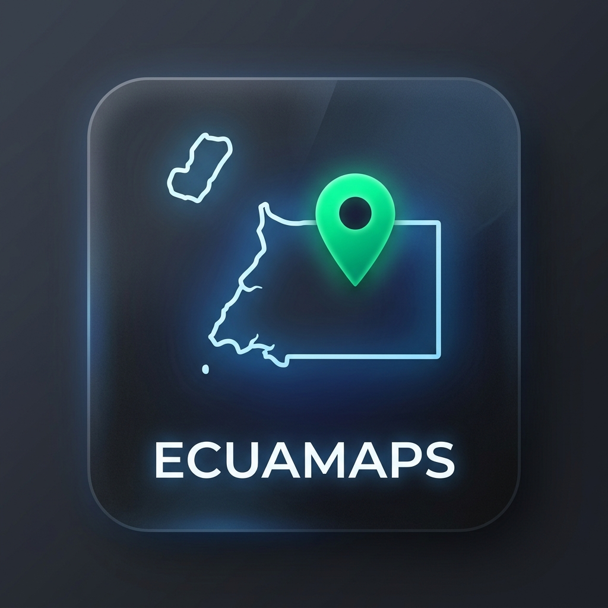

  

<h1 align="center">ECUAMAPS</h1>

**ECUAMAPS** es una aplicación de navegación GPS y mapas offline de alto rendimiento, optimizada específicamente para **Guinea Ecuatorial**. Basada en el motor de ECUAMAPS, ECUAMAPS ofrece privacidad total, consumo de batería ultra bajo y mapas vectoriales detallados de la Región Insular (Malabo) y Continental (Bata, Djibloho).

## Características Especiales de Guinea Ecuatorial
- **Puntos de Interés Locales**: Hospitales, Campus AAUCA, Gasolineras y Mercados actualizados.
- **Navegación 100% Offline**: Sin necesidad de datos móviles para moverte por todo el país.
- **Multilingüe**: Soporte para Español, Fang, Bubi y Francés.
- **Optimización Energética**: Diseñada para durar en trayectos largos sin acceso a carga.

## Desarrollo
Este proyecto es una versión mejorada de ECUAMAPS, adaptada para las necesidades de conectividad limitada en la región centroafricana.

---
**© ECUA-GE VISION 2026** | Construyendo el futuro digital de Guinea Ecuatorial.
